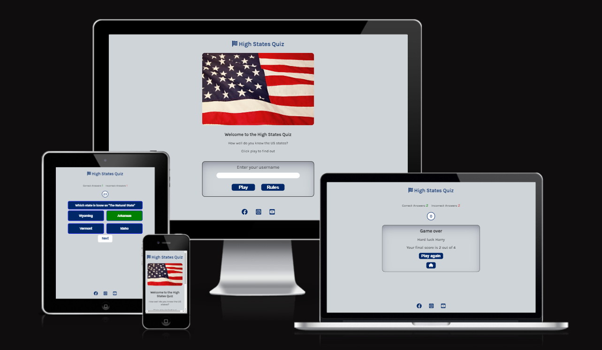
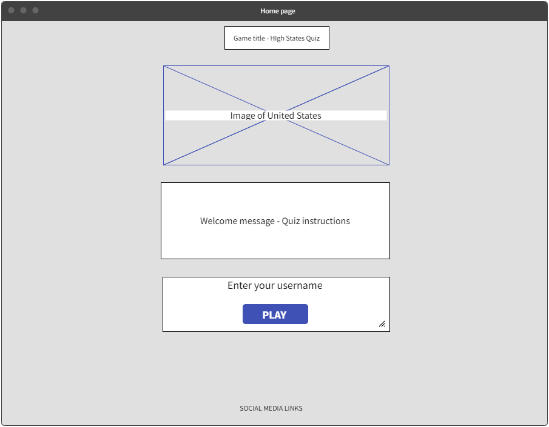
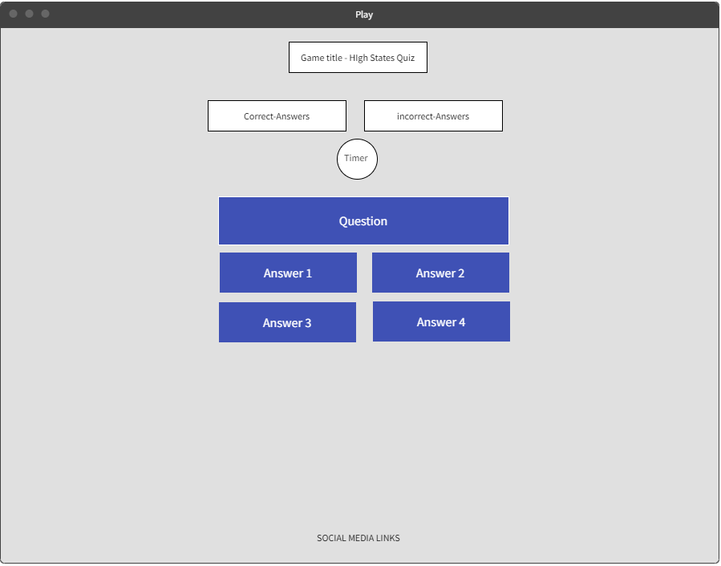
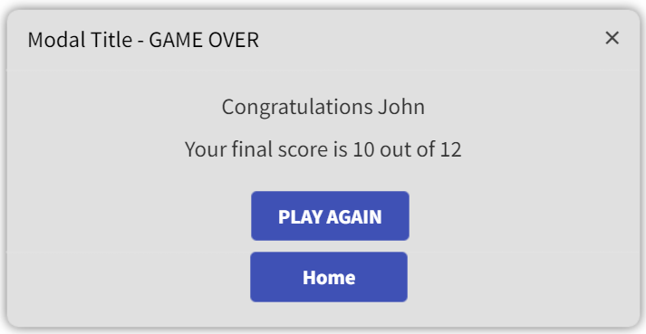
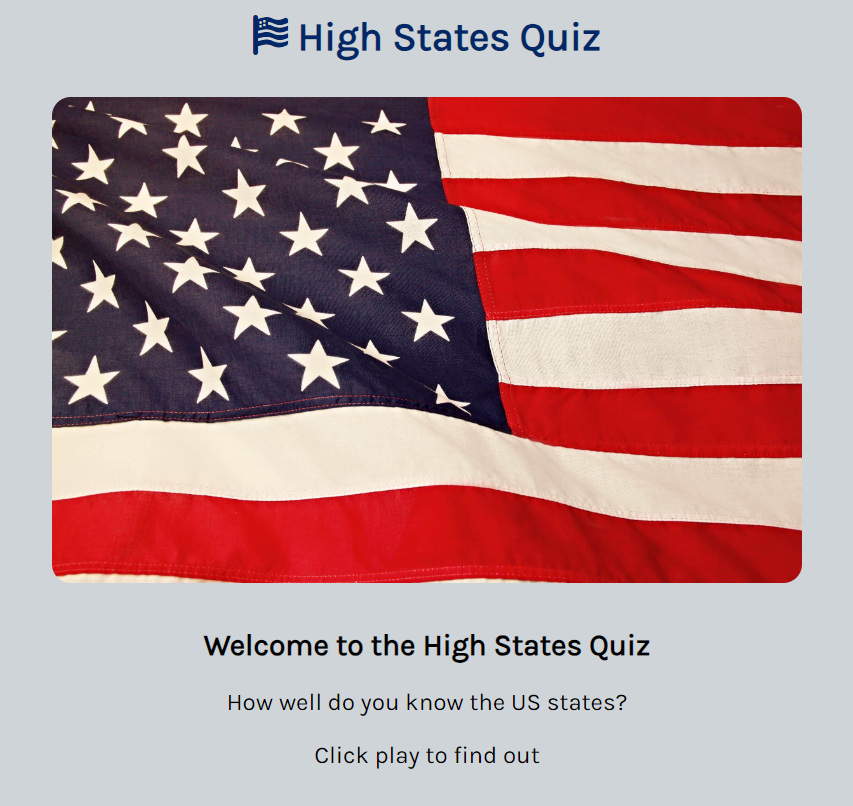
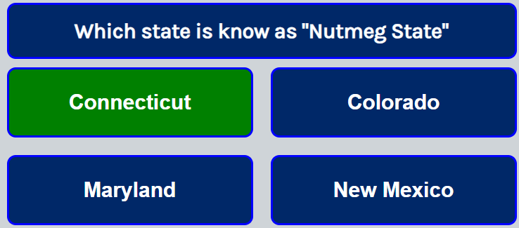
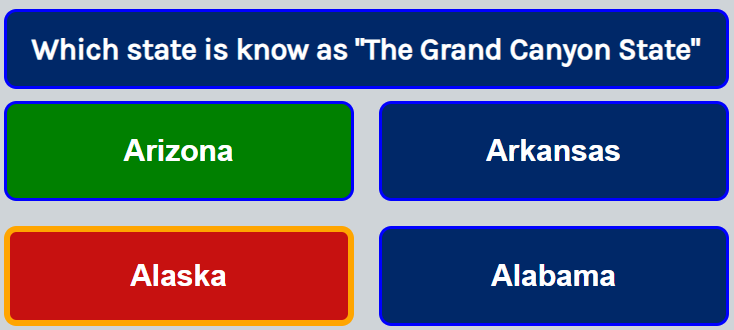
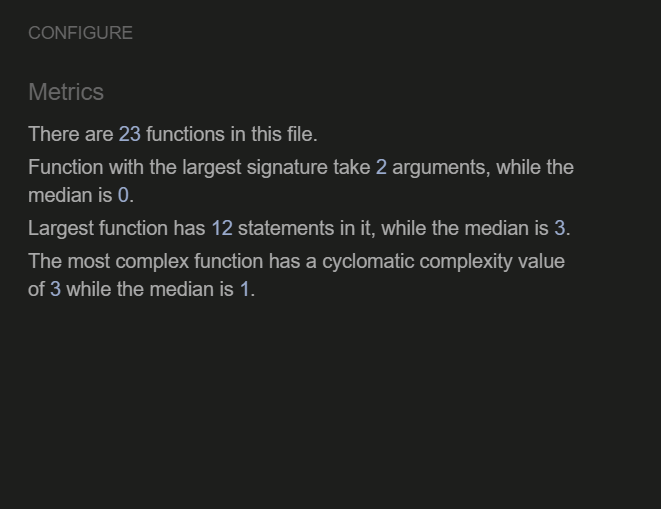
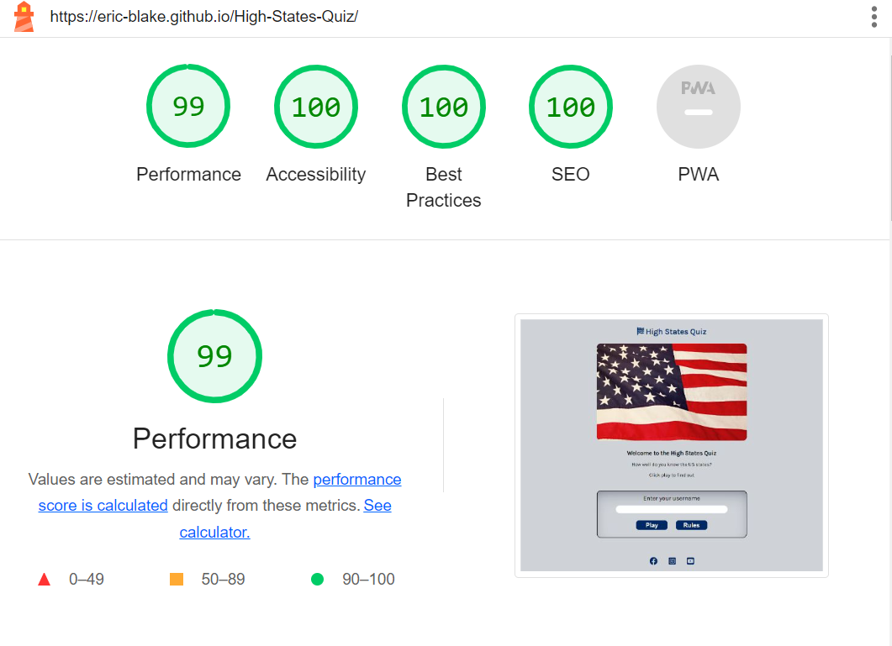
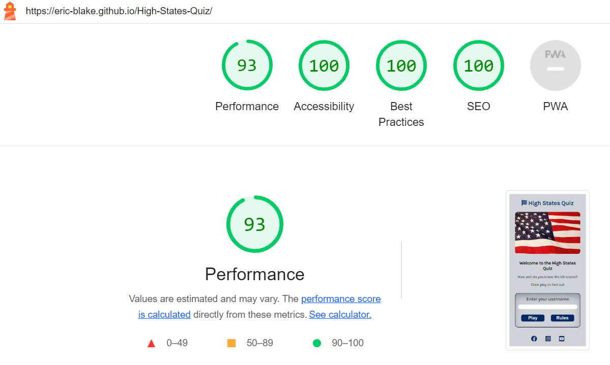

# High States Quiz

The high states game is a quiz based game that tests the users knowledge of the nicknames of the states of the United States of America. The user enters their username and then clicks on play game. The user has to answer as many questions as possible in 60 seconds. At the end of the game the user is presented with their final score. 

-By Eric Blake

# [Live site](https://eric-blake.github.io/High-States-Quiz/ "Live site") 

## UX design

### Colors
* Keeping with the colours of the US flag theme, the color used for the questions is a navy blue #002868 and white
* The background color used is a form of grey #cfd4d8.

### Font
* The font used throughout is Karla.

### Images
* The image used on the main page is for decorative purposed only, and is from pexels.com.

### Wireframe
* The wireframe was created using Mockflow.
 
 
 

## Features

### The welcome page:
* The landing page includes a header and photograph to allow the user to see the name of the quiz.
* This section gives the user the instructions for the quiz

### Enter username section:
* The user must enter their username before stating the quiz.
* The username must be at least two characters long or a username alert will be displayed.

### Questions and answers box:
* This section will show the question and four possible answers.

### Correct answer selected:
* If the correct answer is selected the button will flash green three times and then remain green

### Incorrect answer selected:
* If the incorrect answer is selected the button will turn red and the correct answer will flash green three times

### Scoreboard:
* The scoreboard will increment the correct and incorrect answers.

### Countdown timer:
* The countdown timer starts when the user clicks on play quiz. The first question is presented to the user
* The timer counts down from 60 seconds, and after 60 seconds the Game-over function is called.

### Game over modal:
* After 60 seconds has elapsed, the game is over and the user will be presented with their final score

### The Footer:
* The footer section includes the relevant social media sites for the High states game
* The links will open to a new tab to allow easy navigation for the user.

### Features left to implement:
Add users score to a top scores table 

## Testing:

### Manual Testing
| Test | Result |
| ------------- | ------------- |
| This site works in different browsers: Chrome, Microsoft Edge, Firefox, Safari | Pass|
| This site is responsive, looks good and functions on all standard screen sizes using the devtools device | Pass  |
| The welcome page and quiz page and are all readable and easy to understand  | Pass |
| If no username or invalid username is entered an invalid username message is displayed   |Pass  | 
| When valid username is entered and play button selected the quiz begins  |Pass  |
| When quiz begins a question and four answers are displayed   |Pass   | 
| When quiz begins the countdown timer starts counting down from 60 seconds  |Pass   | 
| When user selects answer it will flash green if correct and turn red if incorrect | Pass  | 
| When user selects answer it will turn red if incorrect and correct answer will flash green  | Pass  | 
| The scoreboard displays the number of correct and incorrect answers  | Pass  | 
| The game over modal displays the users name and final score  | Pass  | 
| When the user selects play again the quiz restarts  | Pass  | 

### Validator Testing:
* HTML
    * No errors were returned when passing through the official W3C validator. 
    
* CSS
    * No errors were found when passing through the official (Jigsaw) validator.
    
* Javascript
  * No errors were returned when passing through JS Hint checker.
    

* Accessibility
    * I confirmed that the colors and fonts used are easy to read and accessible by running it through Google Chrome lighthouse in devtools.
     #### Desktop 
     

     #### Mobile
     

## Bugs
* ### Fixed bugs
| Bug | Fix |
| ------------- | ------------- |
| User can keep clicking on correct answer and increment the score | Add disable button once answer button is selected |
| Game over function called immediately on selecting answer for last question, preventing user from seeing if their answer was correct  | add timeout to allow the final answer selected to be seen before calling modal  |
| Only answers for first question were being shuffled | Moved shuffle answer sort method to correct function|
| Footer was not at bottom of page in quiz page | Updated position property in CSS |

* ### Unfixed Bugs
No unfixed bugs

## Deployment and local development
### Deployment
The site was deployed to GitHub pages. The steps to deploy are as follows
* In the Github repository, navigate to the Settings tab.
* From the source section drop-down menu, select the Master Branch.
* Once the Master Branch has been selected, the page will be automatically refreshed with a detailed ribbon display to indicate the successful deployment.

### Cloning the repository
The repository was cloned to my local PC. The steps to clone are as follows.
* In the Github repository, navigate to the main page of the repository.
* Click on the green Code button and copy the URL.
* Select Clone by HTTPS option.
* Open the code editor and within the terminal change the directory to the location you want to clone the repository to.
* Type git clone and paste the URL copied earlier.
* Press enter to create the local clone.

    
### Forking the repository
By forking the repository, you can make a copy of the repository and make changes without affecting the original repository. the steps to fork are as follows
* Locate the repository in Github.
* On the top right corner of the page click Fork.
* A copy of the repository will now be created in your own repository

## Credits
 * The image on the Home page was taken from [Pexels](https://www.pexels.com/ "Pexels").
 * The icons in the footer were taken from [Font Awesome](https://fontawesome.com/ "Font Awesome").
 * The code to make the CSS flexbox was taken from [CSS-tricks.com](https://css-tricks.com/snippets/css/a-guide-to-flexbox/ "CSS-tricks" ).
 * The code to make the CSS Grid was taken from [CSS-tricks.com](https://css-tricks.com/snippets/css/complete-guide-grid/ "CSS-tricks").
 * Instructions throughout project was taken from [Code Institute](https://codeinstitute.net/ie/ "Code Institute") Tutorials and Love Maths project.
 * The wireframe was created using [Mockflow](https://mockflow.com/ "Mockflow").
 * The Favicon was taken from [Icons8](https://icons8.com/ "Icons8").
 * Get Question and show questions and answers concept from Youtube tutorial[Youtube](https://www.youtube.com/watch?v=riDzcEQbX6k "Youtube")
 * Countdown timer concept from Youtube tutorial [Youtube](https://www.youtube.com/watch?v=GhePFBkdNYk  "Youtube")

## Acknowledgements
*  Mitko Bachvarov. My mentor who provided me with advice and feedback throughout this project